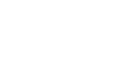

# Frihet, Tillit, Skaperglede, Rettferdighet, Åpenhet
>“Vi skal skape en trygg plattform for fellesskap, involvering og kontinuerlig fornyelse – slik at vi tilrettelegger for individer som positivt påvirker konsulentbransjen og den teknologiske videreutviklingen av Norge”

## Hvorfor jobbe i Elate?
Du ønsker deg en trygg arbeidsgiver, som gir deg mye frihet. Hvor du kan være med å påvirke konsulentbransjen positivt. Du ønsker en rettferdig lønn, et sosialt miljø med fokus på kompetanseheving og -deling.

## Lønnen i Elate
Elate har provisjonsbasert lønn. 

| Regneeksempel: |
|:--|
| Timepris: 1150kr eks mva |
|  Antall timer fakturert (år): 1650 |
| Brutto årslønn (inkl feriepenger og pensjon): 1’164’000 kr |

 
*Les mer på [https://phb.elate.no/#/articles/lonn-og-kompensasjon](https://phb.elate.no/#/articles/lonn-og-kompensasjon)*

# Bonus i Elate
Av årsresultatet settes noe av til egenkapital for å opprettholde 20%. Av resterende går 70% til bonus, og 30% til utbytte. Alle får samme bonus per måned ansatt det året.

Historisk bonusbetaling (fullt år):

| År | Utbetaling |
|:--|:--|
| 2018 | 78’500 |
| 2019 | 72’400 |
| 2020 | 66’000 |

*Les mer på [https://phb.elate.no/#/articles/lonn-og-kompensasjon?id=bonus](https://phb.elate.no/#/articles/lonn-og-kompensasjon?id=bonus)*

# Personlig budsjett
39’000kr/år + 31’000 engangssum ved oppstart. Dette dekker laptop, mobil, kurs, konferanser, bøker og dingser som du trenger for jobben og kompetanseheving. Du bestemmer hva du trenger, Elate eier utstyret. Utstyr kan kjøpes ut privat ved ønske.

*Les mer på [https://phb.elate.no/#/articles/personlig-budsjett](https://phb.elate.no/#/articles/personlig-budsjett)*

# Garantilønn
Det skal lønne seg å være i oppdrag, men det skal også være et sikkerhetsnett for den tiden man er “på benken” mellom oppdrag. I Elate har vi derfor en garantilønn som tilsvarer ca 650’000 i året.

*Les mer på [https://phb.elate.no/#/articles/lonn-og-kompensasjon?id=bonus](https://phb.elate.no/#/articles/lonn-og-kompensasjon?id=bonus)*

# Internfakturering:
Dersom en ansatt ønsker å bidra innen en eller flere av kjerneprosessene i Elate; salg, admin, rekruttering, økonomi, sosial, kompetanse) så føres det tid på dette til en fast timesats. Denne tiden belønnes på samme måte som fakturering til en timepris på 850 kr (ca 443 kr brutto)

*Les mer på [https://phb.elate.no/#/articles/internfakturering](https://phb.elate.no/#/articles/internfakturering)*

# Rekrutteringsbonus:
I Elate tror vi på nettverksrekruttering. Det er de ansatte som best vet hvem som burde bli våre nye kollegaer. Tips som fører til ansettelse belønnes med 50’000kr brutto bonus, samt tilbud om å kjøpe 1% av aksjene i Elate.

>Vi er i dag 14 konsulenter i Elate og vi planlegger å stoppe rekruttering et sted mellom 30 og 40 konsulenter. For oss er det viktig at man kjenner alle i bedriften da vi mener at det er mer givende og forenkler kompetansedeling mellom konsulenter. Det haster ikke, det viktige er at det er de riktige personene som begynner i Elate 
>
>-elate.no

*Les mer på [https://phb.elate.no/#/articles/rekrutteringsbonus](https://phb.elate.no/#/articles/rekrutteringsbonus)*

# Foreldrepermisjon
Ansatte i foreldrepermisjon får tilskudd på ca 21’000 i måneden (på toppen av det som betales ut av NAV).

*Les mer på [https://phb.elate.no/#/articles/foreldrepermisjon](https://phb.elate.no/#/articles/foreldrepermisjon)*

# Kompetanseheving og Skaperglede
Kompetanse er selve kjernen i Elate, derfor legger vi stor vekt i å innhente og bygge kompetanse. Elate legger opp til at kompetanse kan innhentes i flere typer arenaer, kursing, summits, konferanser, problemløsning i gruppe og fagdager.

# Sosial, lønningspils, gaming, kontoret
Å ha sosiale aktiviteter er en hyggelig og enkel måte å dele erfaringer på, og for å bli bedre kjent. Derfor har vi flere ulike sosiale aktiviteter i Elate der hensikten er å lære hverandre å kjenne og ha det gøy.

# Veien videre
Vår prosess er enkel:
1. Et første møte der vi diskuterer ønsker og mål med å være konsulent samt en
gjennomgang av Elate som selskap, våre verdier, og hva som skiller oss fra andre.
2. Flinke personer ønsker å arbeide med andre flinke personer, derfor gjennomfører vi
en teknisk dialog i stedet for et intervju som steg nummer to.
3. Når det er avklart og dialogen var givende for begge parter gis tilbud om ansettelse
i Elate med tilhørende avtalegjennomgang.

#### Les mer på [elate.no](https://elate.no) og [phb.elate.no](https://phb.elate.no)
